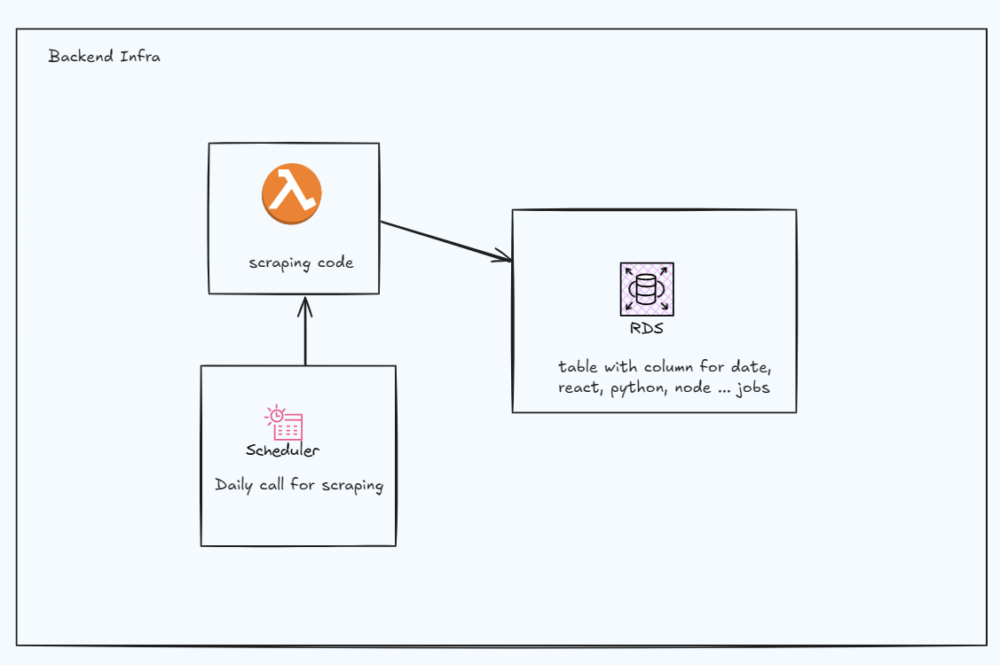

# Web Scraper App

This project is a web scraper application built using Node.js and Playwright. It is designed to scrape job openings for specific technologies: React, Node, and Python.

## Table of Contents

- [Installation](#installation)
- [Usage](#usage)
- [Contributing](#contributing)
- [License](#license)

## Installation

1. Clone the repository:
   ```
   git clone https://github.com/Umesh-daiict/scrapyjo.git
   ```

2. Navigate to the project directory:
   ```
   cd scrapyjo
   ```

3. Install the dependencies:
   ```
   pnpm install
   ```

## Usage

To run the web scraper, execute the following command:
```
pnpm run start
```

This will initialize the Playwright browser, scrape job openings for React, Node, and Python, and log the total number of job openings found.

```
pnpm run debug
```

This will initialize the Playwright browser with debug mode, scrape job openings for React, Node, and Python, and log the total number of job openings found.

## Output
```
> web-scraper-app@1.0.0 start /home/umesh/node/scrapyjo
> node src/index.js

Scraping job openings from https://www.foundit.in/...
Job openings for title "React": 1475
Job openings for title "Node": 387
Job openings for title "Python": 1757
Job openings for title "Software Engineer": 6970
Job openings for title "Frontend Developer": 505
Job openings for title "Backend Developer": 522
Jobs: {
  React: 1475,
  Node: 387,
  Python: 1757,
  'Software Engineer': 6970,
  'Frontend Developer': 505,
  'Backend Developer': 522
}
```
## Contributing

Contributions are welcome! Please open an issue or submit a pull request for any improvements or bug fixes.

## License

This project is licensed under the MIT License. See the LICENSE file for details.

## Infra

This project uses AWS services for scraping jobs. It is a serverless application that utilizes AWS Lambda, RDS, and S3 to perform the scraping tasks.

For more details, refer to the architecture diagram:
[Excalidraw Diagram](https://excalidraw.com/#json=WaXRcUCyqgUxyaPtSR34C,QAh9bs3ZCOmbf0EqgQr6qA)



## todo

 aws deplaoy , vidoe
 infra as code 